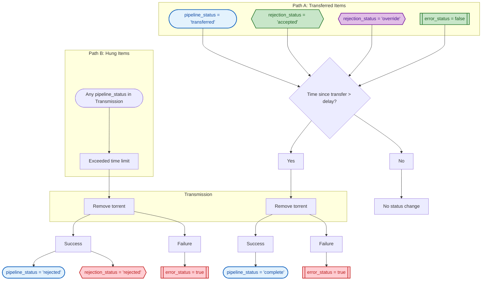

# Media Pipeline Data Flow

Mermaid flowcharts showing conditions that change `pipeline_status`, `rejection_status`, or `error_status`.

---

## Status Key

---

## 01 - RSS Ingest

### Summary

| Condition | Status | Value |
|-----------|--------|-------|
| New hash | `pipeline_status` | `ingested` |
| New hash | `rejection_status` | `unfiltered` |
| New hash | `error_status` | `false` |

---

## 02 - Collect

Collects ad-hoc items added directly to Transmission (not from RSS feeds). This is a **parallel entry point** to the pipeline. Also re-enables previously rejected items still present in Transmission.

### Summary

| Path | Condition | Status | Value |
|------|-----------|--------|-------|
| A | New ad-hoc item | `pipeline_status` | `ingested` |
| A | New ad-hoc item | `rejection_status` | `override` |
| A | media_type == unknown | `error_status` | `true` |
| A | media_type == unknown | `error_condition` | `'media_type is unknown'` |
| A | media_type != unknown | `error_status` | `false` |
| B | Previously rejected item in Transmission | `rejection_status` | `override` |

---

## 03 - Parse

Parses media titles to extract metadata (resolution, codec, year, season, episode, etc.) and validates mandatory fields based on media type.

### Validation Rules

| Media Type | Mandatory Fields |
|------------|------------------|
| All | `media_title` |
| movie | `release_year` |
| tv_show | `season`, `episode` |
| tv_season | `season` |

### Summary

| Condition | Status | Value |
|-----------|--------|-------|
| Validation passes | `pipeline_status` | `parsed` |
| Validation fails | `error_status` | `true` |
| Validation fails | `error_condition` | e.g. `'media_title is null'` |

---

## 04 - File Filtration

Filters media based on file metadata (resolution, codec, etc.) using rules from `filter-parameters.yaml`. Override status bypasses filtering.

### Summary

| Condition | Status | Value |
|-----------|--------|-------|
| rejection_status == override | `pipeline_status` | `file_accepted` |
| rejection_status == override | `rejection_status` | `override` (unchanged) |
| Filter passes | `pipeline_status` | `file_accepted` |
| Filter passes | `rejection_status` | `accepted` |
| Filter fails | `pipeline_status` | `rejected` |
| Filter fails | `rejection_status` | `rejected` |
| Exception during filter | `error_status` | `true` |

---

## 05 - Metadata Collection

Collects metadata from TMDB (search + details) and OMDb (ratings). Items with existing metadata in DB skip API calls.

### Summary

| Condition | Status | Value |
|-----------|--------|-------|
| TMDB search fails | `pipeline_status` | `rejected` |
| TMDB search fails | `rejection_status` | `rejected` |
| API error | `error_status` | `true` |
| Metadata collected | `pipeline_status` | `metadata_collected` |

---

## 06 - Media Filtration

ML-powered filtering using reel-driver. TV shows/seasons are exempt. Movies are scored and compared against threshold.

### Summary

| Condition | Status | Value |
|-----------|--------|-------|
| TV show / TV season | `pipeline_status` | `media_accepted` |
| TV show / TV season | `rejection_status` | `accepted` |
| rejection_status == override | `pipeline_status` | `media_accepted` |
| rejection_status == override | `rejection_status` | `override` (unchanged) |
| No imdb_id | `pipeline_status` | `rejected` |
| No imdb_id | `rejection_status` | `rejected` |
| probability >= threshold | `pipeline_status` | `media_accepted` |
| probability >= threshold | `rejection_status` | `accepted` |
| probability < threshold | `pipeline_status` | `rejected` |
| probability < threshold | `rejection_status` | `rejected` |
| reel-driver API error | `error_status` | `true` |

---

## 07 - Initiation

Adds accepted media items to Transmission to begin downloading.

### Summary

| Condition | Status | Value |
|-----------|--------|-------|
| Torrent added to Transmission | `pipeline_status` | `downloading` |
| Failed to add torrent | `error_status` | `true` |

---

## 08 - Download Check

Monitors Transmission for download progress. Handles missing items by re-ingesting.

### Summary

| Condition | Status | Value |
|-----------|--------|-------|
| Not found in Transmission | `pipeline_status` | `ingested` (re-ingest) |
| Not found in Transmission | `rejection_status` | `unfiltered` |
| Not found in Transmission | `error_status` | `false` (reset) |
| Still downloading | - | No change |
| Download complete + valid filename | `pipeline_status` | `downloaded` |
| Download complete + invalid filename | `error_status` | `true` |

---

## 09 - Transfer

Moves downloaded files from download directory to Plex library based on media type.

### Summary

| Condition | Status | Value |
|-----------|--------|-------|
| Path generation fails | `error_status` | `true` |
| File transfer fails | `error_status` | `true` |
| File transfer succeeds | `pipeline_status` | `transferred` |

---

## 10 - Cleanup

Removes torrents from Transmission after successful transfer or when items exceed time limits.

### Summary

| Path | Condition | Status | Value |
|------|-----------|--------|-------|
| A | Transferred + delay exceeded + removal succeeds | `pipeline_status` | `complete` |
| A | Transferred + delay not exceeded | - | No change |
| A | Removal fails | `error_status` | `true` |
| B | Hung item + removal succeeds | `pipeline_status` | `rejected` |
| B | Hung item + removal succeeds | `rejection_status` | `rejected` |
| B | Hung item + removal succeeds | `rejection_reason` | `'exceeded time limit'` |
| B | Removal fails | `error_status` | `true` |
